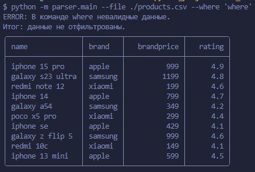
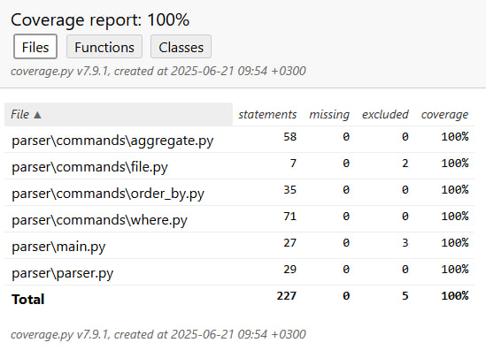

# test_workmate

Программа разрабатывалась на Python 3.12.

## Установка и запуск

```bash
$ git clone git@github.com:SivikGosh/test_workmate.git
$ cd test_workmate/
$ python3.12 -m venv venv
$ source venv/bin/activate

(venv) $ pip3 install -r requirements.txt
(venv) $ python3.12 -m parser.main --file ./product.csv
```

#### Вывод тестовых данных без каких-либо доп. условий


## Команды

### Аргумент '--where'

| поле       | доступные операции | примечание                             |
|-----------:|:------------------:|:---------------------------------------|
| name       | =                  | доступен поиск по частичному значению. |
| brand      | =                  | доступен поиск по частичному значению. |
| brandprice | >, <, =            |                                        |
| rating     | >, <, =            |                                        |

#### Примеры:


#### В случае ошибки, данные не фильтруются:


### Аргумент '--aggrerate'

| поле       | доступные операции |
|-----------:|:------------------:|
| brandprice | avg, min, max      |
| rating     | avg, min, max      |

#### Примеры:


### Комбинирование аргументов
#### --where и --aggregate можно совмещать:


## Тестирование

### Покрытие кода тестами выполнено на 100%


### В проект также включены mypy, isort, flake8. Вместе с pytest они автоматически запускаются в пре-коммите.

```bash
# автотесты
(venv) $ pre-commit install  # активация пре-коммита
```

### Ручной прогон тестов, форматтеров и линтеров

```bash
# автотесты
(venv)$ pytest . -v

# покрытие тестами
(venv)$ pytest . --cov=parser  # вывод в консоль
(venv)$ pytest . --cov=parser --cov-report=html  # формирование отчёта

(venv)$ make install  # установка библиотек (нужно только 1 раз)
(venv)$ make check  # проверка на типы, импорты, PEP8
```
